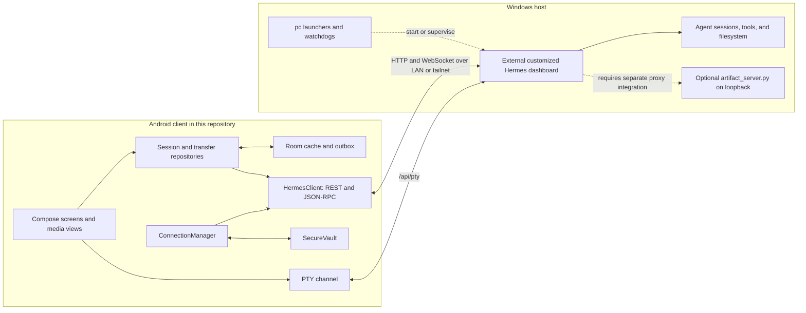

# Hermes Remote

**An Android companion for controlling a desktop Hermes Agent dashboard, with conversation, activity, terminal, and media views.** Keep agent execution on the PC while using a native phone interface over a private network.

[](app/build.gradle.kts)
[](build.gradle.kts)
[](app/build.gradle.kts)
[](LICENSE)

[Quickstart](#quickstart) · [Architecture](#architecture) · [Security](#security-and-deployment) · [Source map](#source-map) · [Contributing](#contributing)

> **Read before building:** this checkout is not a self-contained Android-plus-backend distribution. It lacks the Gradle wrapper JAR/properties and `gradlew.bat`. The `pc/` scripts launch a separately installed, customized Hermes backend; they do not contain that backend. See the prerequisites below instead of assuming `./gradlew` or a PC `requirements.txt` can bootstrap the system.

<!-- SCREENSHOT_GALLERY -->

## What is here

- **Cockpit, Activity, Sessions, Terminal, and Ops** are the app's main destinations. Session repositories call the dashboard's create/resume/list operations; a separate PTY channel handles terminal traffic.
- **Pairing and reconnect handling** use saved profiles, status discovery, password login, cookies, and per-socket ticket requests.
- **Conversation media** includes attachment components, Coil image rendering, Media3 video components, and a WebView-based artifact view. These require the corresponding backend data/API support.
- **File-transfer code** uploads base64 in JSON and downloads raw bytes. `TransferRepository` enforces a **48 MiB** upload limit and defaults to the PC inbox `D:/HermesInbox`; it is not a constant-memory multipart uploader.
- **PC tooling** includes dashboard launchers, pairing helpers, watchdog scripts, and an optional TSX/JSX artifact compilation service.

These describe the checked-in implementation, not an end-to-end validation matrix. Phone disconnects, process kills, and backend restarts still need testing against your chosen backend. The backend decides what the PTY launches; it is not necessarily a bare operating-system shell.

## Architecture



The client connection contract is grounded in [ConnectionManager](app/src/main/java/com/hermes/mobile/core/connection/ConnectionManager.kt) and [CredentialStrategy](app/src/main/java/com/hermes/mobile/core/connection/CredentialStrategy.kt):

1. `GET /api/status` discovers authentication requirements.
2. `POST /auth/password-login` obtains session cookies.
3. `POST /api/auth/ws-ticket` requests a fresh WebSocket ticket.
4. `/api/ws?ticket=…` carries JSON-RPC; `/api/pty` is a separate socket with its own authorized URL.

Ticket lifetime, authorization, agent execution, and persistence are backend responsibilities. This client speaks a Hermes dashboard protocol, not a generic OpenAI-compatible API. Room caches client state; it is not a replacement for the desktop agent.

## Quickstart

### 1. Prepare the Android build environment

The actual Gradle files specify **AGP 8.4.0**, **Kotlin 2.0.21**, Java/Kotlin target **17**, compile/target SDK **35**, and minimum SDK **26**. Use JDK 17, Android SDK platform 35, and platform-tools (`adb`). Configure `JAVA_HOME` and your SDK location; replace the checkout's machine-local `local.properties` SDK path with your own rather than committing someone else's path.

**Build packaging gaps in this tree:**

- `gradlew` exists, but `gradle/wrapper/gradle-wrapper.jar`, `gradle/wrapper/gradle-wrapper.properties`, and `gradlew.bat` do not. The wrapper cannot bootstrap a clean checkout as published.
- `gradle.properties` is also absent. AndroidX dependencies are declared, so the commands below explicitly enable `android.useAndroidX`.
- [build-debug.bat](build-debug.bat) refers to an external **Gradle 8.9** installation and hard-coded Windows paths. It is a local build helper, not a portable bootstrap script.

Use an independently installed Gradle 8.9 on `PATH` for the following source-build route. That version comes from the existing helper, not a newly verified build. AGP 8.4's tested SDK range is below SDK 35, so review any compatibility warnings rather than mistaking these commands for a passing build report.

```powershell
git clone https://github.com/MdSadman20040812/hermes-remote.git
cd hermes-remote
gradle --version
gradle -Pandroid.useAndroidX=true :app:assembleDebug :app:testDebugUnitTest
adb install -r app\build\outputs\apk\debug\app-debug.apk
```

Alternatively, restore a reviewed, complete wrapper configuration before using wrapper commands. USB installation requires an authorized device with USB debugging enabled. The debug application ID is `com.hermes.mobile.debug`.

### 2. Supply the separate backend and pairing dependencies

Before launching the PC side:

- Install a compatible customized Hermes backend with the dashboard CLI, prepared dashboard assets, the REST/JSON-RPC/PTY APIs above, and a configured basic-auth provider. An arbitrary upstream install is not a compatibility guarantee.
- Review [pc/hermes-remote.ps1](pc/hermes-remote.ps1): it assumes `D:\.hermes`, a checkout at `D:\.hermes\hermes-agent`, and that checkout's `venv\Scripts\python.exe`. It invokes `python -m hermes_cli.main dashboard ... --skip-build`; it does not install or implement the server.
- Adapt all machine-specific paths before execution. Several helpers hard-code `D:\HermesMobile\pc`, even though this repository is named `hermes-remote`.
- Provide a local matching `pc/.dashboard-password` for helpers that read it. Never commit or share that file.
- Install `qrcode` into the Python environment used by the QR renderer, for example `python -m pip install qrcode` with the correct interpreter selected. The scripts search `pc/vendor/`, but that directory is absent from this tree. There is no `pc/requirements.txt` to install.
- Allow the intended devices to reach the dashboard, normally on `9119`, using deliberately scoped firewall/network policy.

Once these prerequisites are in place, from the repository root:

```powershell
powershell -File .\pc\hermes-remote.ps1 -NoFirewall
```

`-NoFirewall` leaves firewall setup to you. The script starts/reuses the external dashboard and produces the pairing payload. Scan it in the app or use manual pairing. The payload contains credentials.

[pc/qr_server.py](pc/qr_server.py) is an alternative pairing-page helper: after adapting paths and credentials, `python pc/qr_server.py` serves `http://localhost:9120` on the PC. It deliberately has no login and displays the password; never expose that page off-box.

### 3. Optional artifact service

[pc/artifact_server.py](pc/artifact_server.py) accepts source at `/compile`, serves generated pages at `/artifact/<id>`, and exposes `/health`. It defaults to `127.0.0.1:9121`. Compilation requires `esbuild` or Node/npm's `npx`; the `npx --yes esbuild` fallback may download a package. Backend proxy integration is an additional prerequisite and is not provided by merely starting this helper.

```powershell
# Optional, only after reviewing the helper and its dependencies
python pc/artifact_server.py --host 127.0.0.1 --port 9121
```

Keep this service on loopback. It has no authentication gate of its own and returns permissive CORS headers; a local bind is not a complete security boundary against untrusted content. Treat artifact rendering/compilation as a separate surface to review, not a substitute for dashboard authentication.

## Testing and diagnosis

Run the unit-test task from the build command above, then test a real phone/backend round trip: retrieve sessions, submit a harmless prompt, receive the result, and reconnect. Record your backend revision and device/API level when reporting results.

[pc/phone_sim.py](pc/phone_sim.py) can narrow failures to status, login, or ticket issuance after you adapt its hard-coded username and password-file path:

```powershell
python pc/phone_sim.py <pc-host>
```

It does **not** open a WebSocket, and its printed `/ws` hint differs from the app's `/api/ws`. Passing those HTTP probes from the PC does not prove the phone's route, firewall, WebSocket upgrade, or session recovery. Remove tickets, credentials, and personal paths before sharing diagnostic output.

`_archived-tests/TransferRepositoryDeviceTest.kt` is outside an active `app/src/androidTest/` source set. Its presence does not establish a working instrumentation suite or verified file-transfer integrity.

## Security and deployment

- **Plain HTTP/WS is not encrypted.** Use a trusted private LAN or a correctly configured encrypted tunnel. Do not expose the dashboard directly to the public internet. Tailscale requires connected devices and suitable access policy; it cannot keep an offline PC available.
- [PrivateHosts](app/src/main/java/com/hermes/mobile/core/net/PrivateHosts.kt) allows private/loopback/link-local addresses, CGNAT (`100.64.0.0/10`), and local-name suffixes for cleartext profiles. It is an input allowlist, not proof of host identity or encryption. Review discovered PCs before credentials are reused.
- [SecureVault](app/src/main/java/com/hermes/mobile/core/vault/SecureVault.kt) uses encrypted preferences with an Android Keystore-backed master key. QR payloads, pairing-page contents, and printed passwords remain sensitive.
- Review administrative helpers before use. [install-always-on.ps1](pc/install-always-on.ps1) defaults to a **SYSTEM** scheduled task; [fw-fix.ps1](pc/fw-fix.ps1) changes firewall rules; [hermes-dashboard.py](pc/hermes-dashboard.py) binds to `0.0.0.0` and its restart mode can terminate a port listener. Prefer the least privilege and exposure your deployment needs.
- Backend tools can act on the PC, and model providers may receive prompt data. Manual approvals and local networking are not guarantees that every action is gated or every byte stays offline.
- Do not publish credentials, pairing QR codes, private conversations, machine identifiers, or unreviewed diagnostic screenshots.

## Source map

| Start here | Purpose |
|---|---|
| [Android application](app/src/main/java/com/hermes/mobile/) | Compose UI, models, repositories, services, and transport |
| [Connection/authentication](app/src/main/java/com/hermes/mobile/core/connection/) | Profiles, login strategy, and reconnect handling |
| [Media and artifact components](app/src/main/java/com/hermes/mobile/ui/components/) | Attachment, image/video, and WebView UI |
| [TransferRepository](app/src/main/java/com/hermes/mobile/data/repo/TransferRepository.kt) | File-transfer encoding, limits, and paths |
| [Unit tests](app/src/test/java/com/hermes/mobile/) | Protocol/model parsing, attachments, terminal input, and related checks |
| [PC helpers](pc/) | Launchers, pairing, watchdogs, probes, and optional artifact compiler |
| [V2 specification](HERMES_MOBILE_V2_SPEC.md) · [Build brief](HERMES-BUILD-BRIEF.md) | Design intent and implementation plan |
| [Protocol findings](PHASE0-FINDINGS.md) · [Build log](BUILD-LOG.md) | Historical observations, not current verification |

The historical docs include local-machine assumptions and earlier plans. Use current source/build files to resolve conflicts; do not treat a historical project index as a release or compatibility policy.

## Related repositories

[hermes-mobile](https://github.com/MdSadman20040812/hermes-mobile) contains a related client with the same app namespace, a complete Gradle wrapper, and vendored QR dependencies. This repository's tree includes additional Activity/media/artifact components and a PC artifact compiler, but omits those build/QR packaging files. These are concrete tree differences, not evidence that either repository is the latest or canonical release. Matching application IDs mean builds may replace one another on a device.

[Nous Research / Hermes Agent](https://github.com/NousResearch/hermes-agent) is the upstream agent project. This repository's mobile interface and host helpers are separate work; the customized backend they expect is not bundled here.

## Contributing

[Open an issue](https://github.com/MdSadman20040812/hermes-remote/issues) with a minimal reproduction, device/API level, build-tool versions, backend revision, and sanitized logs. Useful contributions include a complete reproducible build setup, explicit backend compatibility requirements, portable launcher paths, and active device tests. Include exact test commands and their actual results rather than adding unchecked capability badges.

## Credits and license

Created by **Md Sadman Bin Masud**. Built to work with **Hermes Agent by Nous Research**; upstream contributors retain credit for that project.

This repository is licensed under the [MIT License](LICENSE). Upstream and third-party dependencies retain their own licenses.
