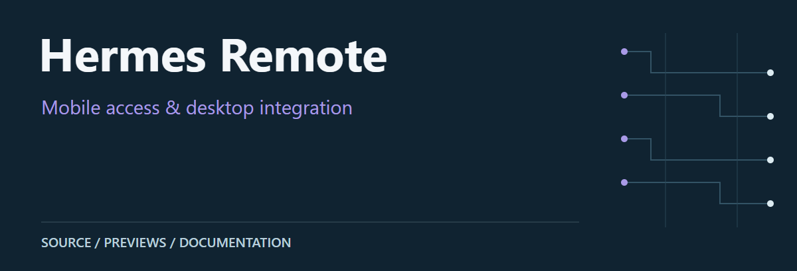
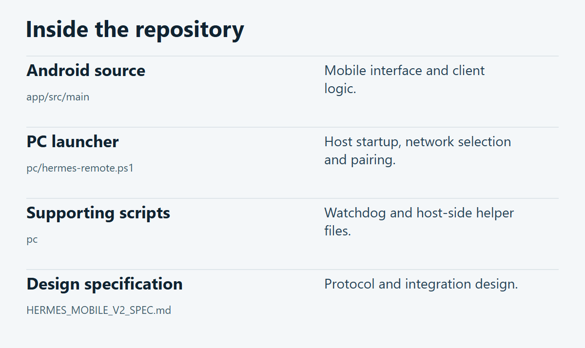

# Hermes Remote

Android and PC integration files for remote access to a desktop Hermes agent. The PC launcher prepares LAN-first connectivity and pairing; the Hermes backend itself is an external dependency.

**[Source guide](#source-guide)** · **[Getting started](#getting-started)** · **[Scope & limitations](#scope--limitations)**

## Preview

Existing Android file-transfer screen shared by the mobile/remote project.

## Source guide

| Component | Open source | Purpose |
| :-- | :-- | :-- |
| Android source | [`app/src/main`](app/src/main) | Mobile interface and client logic. |
| PC launcher | [`pc/hermes-remote.ps1`](pc/hermes-remote.ps1) | Host startup, network selection and pairing. |
| Supporting scripts | [`pc`](pc) | Watchdog and host-side helper files. |
| Design specification | [`HERMES_MOBILE_V2_SPEC.md`](HERMES_MOBILE_V2_SPEC.md) | Protocol and integration design. |

## Getting started

Use the linked source files and project documents above as the entry points. Review the prerequisites and limitations below before execution.

## Scope & limitations

Start with the PC launcher source and review its local paths and authentication requirements. Do not expose the dashboard directly to the public internet. This repository is not a complete standalone distribution of the Hermes backend.

## License

See the repository’s [LICENSE](LICENSE).

---

[Visual asset sources and presentation notes](docs/visuals/README.md)
