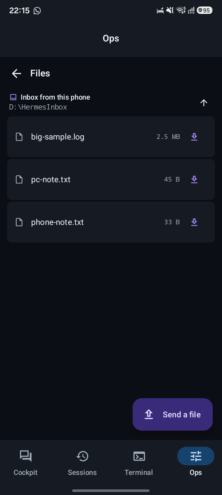
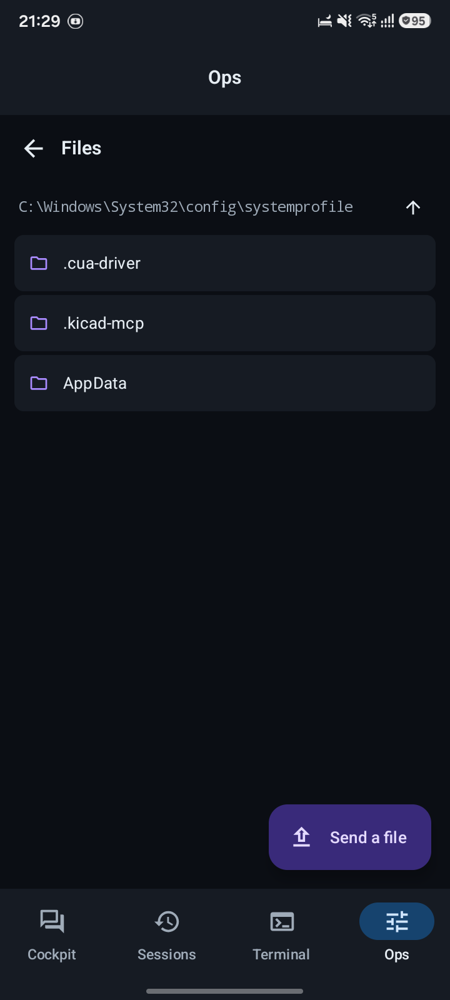
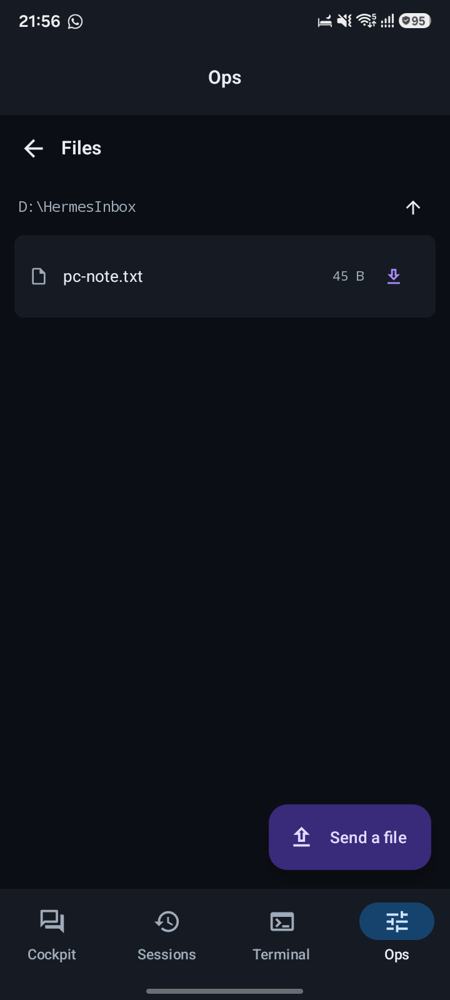
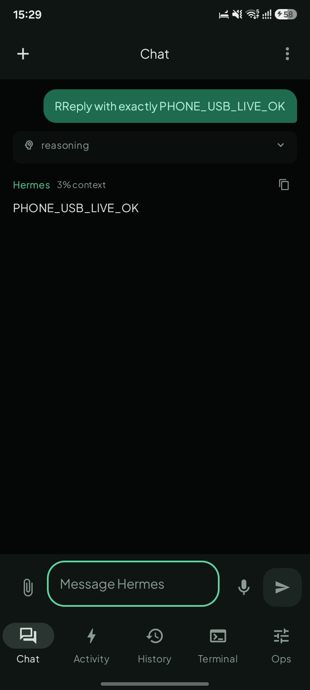
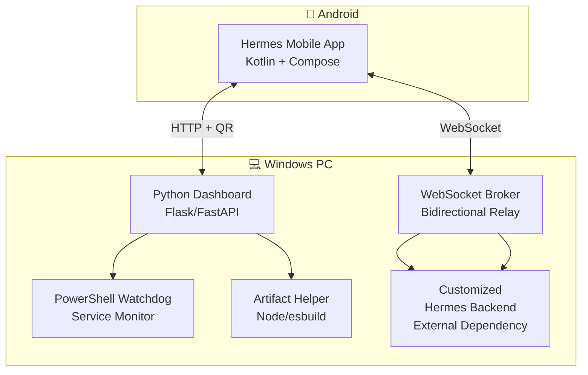

**PC-side scripts for the Hermes Remote system — launchers and tools for use with a customized Hermes backend.**

---

## 🖼️ Screenshots


*Remote control panel — command execution and session management.*


*Browse and transfer files between PC and phone.*


*View and manage agent messages.*


*System health check — verify Hermes backend status and connectivity.*

---

## 🏗️ Architecture



---

## ⚠️ Prerequisites

**This repository does not contain a complete standalone build.** The scripts here are launchers and tools designed to work with an **external customized Hermes backend** — you must already have one installed separately.

Missing from this repo (because they belong to the external backend):
- `pc/vendor/` — the customized Hermes distribution
- `pc/requirements.txt` — backend Python dependencies
- `gradle.properties` — Android build configuration
- `gradlew.bat` — Gradle wrapper batch script

---

## ✨ Features

- **PowerShell watchdog** — keeps the backend alive, auto-restarts on crash
- **Python dashboard** — web UI for monitoring and control
- **QR pairing** — generates connection QR scanned by the phone
- **Artifact helper** — Node/esbuild integration for frontend builds
- **System health check** — `hermes-check.py` validates backend status

---

## 🚀 Quick Start

```bash
# Requires an existing customized Hermes backend
git clone https://github.com/MdSadman20040812/hermes-remote.git
cd hermes-remote

# Install Python deps
cd pc
pip install -r requirements.txt  # if present, else use backend's

# Start watchdog (keeps backend alive)
.\hermes-watchdog.ps1

# Start dashboard
python hermes-dashboard.py
# → http://localhost:8080
```

---

## 📁 Project Structure

```
hermes-remote/
├── pc/
│   ├── hermes-watchdog.ps1        # PowerShell service monitor
│   ├── hermes-dashboard.py        # Python web dashboard
│   ├── hermes-check.py            # System health check
│   ├── hermes-broker.py           # WebSocket relay
│   └── hermes-artifact-helper.py  # Frontend build integration
├── docs/screenshots/               # UI screenshots
└── README.md
```

---

## 📄 License

MIT © Md Sadman Bin Masud
